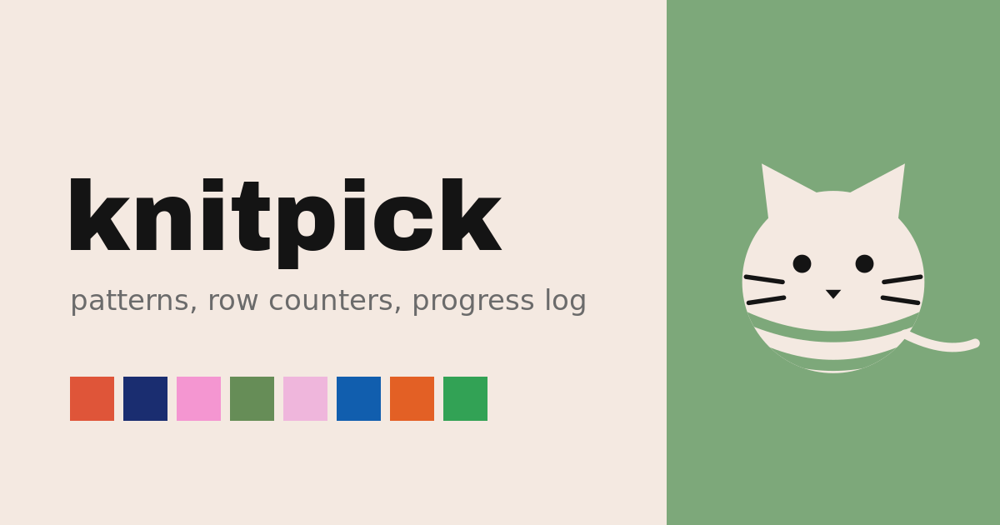

# knitpick

A personal knitting helper: projects with pattern PDFs, linked row counters, and a
notes-and-photos progress log.

Local-first PWA — everything lives in IndexedDB on your device, deployed as a
static site. No server, no accounts, no tracking. Works offline.



## Stack

SvelteKit (static adapter, SPA) · Svelte 5 · TypeScript · Dexie · vanilla CSS

## Design

A warm cream canvas (`#f4e9e1`), ink text (`#141414`), and flat blocks of warm
candy color — no gradients, no shadows. Headlines are set in Archivo Black
(self-hosted, offline-safe); everything else uses the system stack.


Each project is assigned one accent from this cycle (terracotta → sage → navy →
bubblegum → moss → blush → cobalt → orange → grass → petal), used for its cards,
buttons, and counter screen. The order alternates warm/cool and dark/pale so
neighbouring projects never clash. See [`.claude/skills/design/`](.claude/skills/design/SKILL.md)
for the full system.

## PWA implementation

- **Manifest** ([`static/manifest.webmanifest`](static/manifest.webmanifest)) —
  standalone display, cream theme color, and the yarn-cat icon set: 192/512px
  icons, a 180px `apple-touch-icon` for iOS, and a separate maskable variant
  with the artwork inset to the safe zone so Android's circular mask doesn't
  crop the ears.
- **Service worker** ([`src/service-worker.ts`](src/service-worker.ts)) —
  SvelteKit builds and registers it automatically. On install it precaches the
  app shell and every built asset into a cache keyed by the deployment version
  (from the `$service-worker` module); on activate it drops old caches and
  takes over open pages. Fetches are cache-first, and *navigations always get
  the cached shell* — that's what makes the app launch offline and makes deep
  links like `/project/xyz` survive reloads on a static host with no SPA
  rewrites.
- **Storage** — all data (projects, counters, notes, and the PDF/photo blobs)
  lives in IndexedDB via Dexie. On startup the app calls
  `navigator.storage.persist()` so the browser treats the database as
  not-evictable — your patterns shouldn't vanish under storage pressure.
- **Social cards** — Open Graph and Twitter tags with a 1200×630 share image.
  Scrapers need absolute URLs, so `app.html` carries a `__PUBLIC_URL__`
  placeholder that the deploy script replaces with the real origin.

To install on a phone: open the deployed URL, then *Add to Home Screen* (iOS
Safari share menu) or accept the install prompt (Android Chrome).

## Development

```sh
npm install
npm run dev     # dev server
npm run check   # typecheck
npm run build   # production build
```

A [devcontainer](.devcontainer/devcontainer.json) is included for sandboxed development.

## Deployment

Hosted on a Hugging Face static Space:

```sh
HF_TOKEN=hf_xxx npm run deploy <user>/knitpick
```

[`scripts/deploy.sh`](scripts/deploy.sh) builds the app, creates the Space via
the HF API if it doesn't exist yet, fills in the public origin for the social
tags, and force-pushes the build output. The Space only serves app code — all
knitting data stays on the device.

## License

[MIT](LICENSE)
